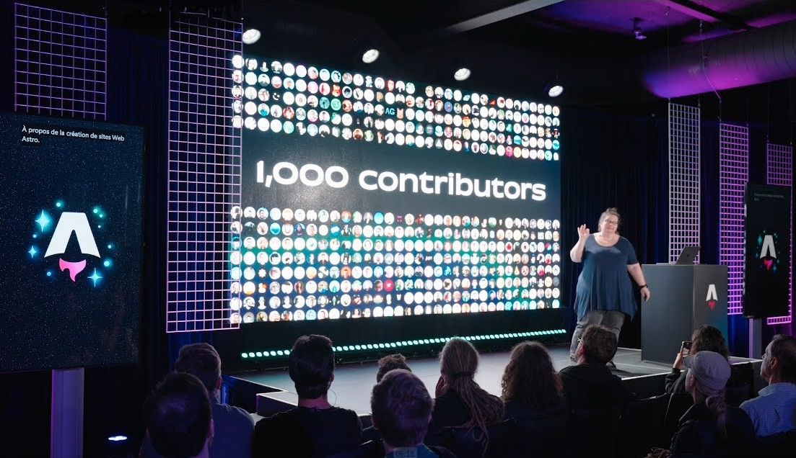

import { LinkCard, Card, CardGrid } from '@astrojs/starlight/components';
import { YouTube } from 'astro-embed';

Sarah photographs birds, watches baseball, and writes docs!

## Conference Bio

Sarah Rainsberger leads a large open source software documentation project with several maintainers and over 1000 community contributors. She brings a background in high school mathematics education, academic counseling, and curriculum development to her current technical writing and open source community building. In her spare time, she photographs birds. 

## Talks & Appearances
{/* 
 */}

Talks and conversations about contributions to open-source projects beyond code: docs, community building, and docs *as* community building.

<LinkCard title="YouTube playlist of talks" href="https://youtube.com/playlist?list=PLowBAHWxr_2DgiS5maPN2wg96dmKho_yC&si=_ckXtTot6ApGcoMk" />

### Conference Talks

📺 [Docs as Community Building](https://www.youtube.com/watch?v=MK4s-P3kqyA) - ViteConf 2024

📺 [Stop writing docs; Start helping](https://www.youtube.com/watch?v=TvWxf13eDwY&list=PLowBAHWxr_2DgiS5maPN2wg96dmKho_yC&index=2) - Frontend Nation 2024

📺 [One year of Starlight: Astro's community-built documentation theme](https://www.youtube.com/watch?v=j8K-ESJF814&list=PLowBAHWxr_2DgiS5maPN2wg96dmKho_yC&index=4) - Astro Together 2024

📺 [Making effective contributions to open source documentation](https://www.youtube.com/watch?v=abw7-BfApMk) - Distribute Aid, Open Source Explorers 2024

📺 [Stop writing docs; Start helping](https://www.youtube.com/watch?v=jcpkVJr-rUw&list=PLqGQbXn_GDmkOsHI7-Wrbv1GgAA4tJZhg&index=26) - ViteConf 2023

📺 [Happy Contributors, High Standards: Pick two! Balancing quality and community in open source documenatation](https://www.youtube.com/watch?v=emgFALmCyrY&list=PLZAeFn6dfHpktOcWn5mQNOx5gYo6O7TR6&index=6) - Write the Docs Australia 2022

📺 [Learning in the Browser](https://www.youtube.com/watch?v=5X-WEQflCL0&list=PLNG_1j3cPCaZZ7etkzWA7JfdmKWT0pMsa&index=9) - ReactConf 2021

📺 [Jamstack in the Browser (Lightning Talk)](https://www.youtube.com/watch?v=tmKlWSIJbuo) - TheJam.dev 2022

### Interviews / Appearances

📺 GitHub Open Source Friday 2025: [Astro Docs](https://www.youtube.com/watch?v=3cJgXfy5Pmg)

🎙️ Kelvin Omereshone's Twitter Space Jan 2023: Making Documentation Developers Love ([listen on YouTube](https://www.youtube.com/watch?v=YW4IfoJM30g)) / ([listen on Spotify](https://open.spotify.com/episode/5QYkgKtsneWhUAebPahIRJ?si=bfTpykAZRLWVBE3wvQiuzQ))

🎙️ GitHub ReadME Podcast: [Episode 31: Bridging code and community](https://github.com/readme/podcast/code-and-community)

📰 GitHub ReadME Project June 2023: [Non-code contributions are the secret to open source success](https://github.com/readme/featured/open-source-non-code-contributions) - Klint Finley

🎙️ Hanselminutes Podcast September 2023: [Episode 911: Documentation as a path to Open Source](https://www.hanselminutes.com/911/documentation-as-a-path-to-open-source-with-sarah-rainsberger)

📺 ViteConf 2023: [Community and Contributors Panel](https://www.youtube.com/watch?v=rqB7hy5lcmc&list=PLqGQbXn_GDmkOsHI7-Wrbv1GgAA4tJZhg&index=29) - Sarah Rainsberger, Brittney Postma, Anthony Fu, and Matias Capeletto, with This Dot Labs' Tracy Lee as host, discuss how to get involved in open source and foster healthier communities.

## Open Source

I am a core maintainer and the Docs Lead for [Astro](https://astro.build), an open-source web framework. I also write and speak about managing and maintaining community-driven, open-source documentation.

### Astro Origin Story

I am a former math teacher/tutor who started to learned to code in 2018 because I inherited a crappy website I volunteered to maintain for my community choir and (only) knew enough HTML to be dangerous.

#### Learning web dev

I started taking online HTML, CSS then eventually JavaScript and React courses through [Scrimba](https://scrimba.com). After I had taken all their "boot camp" courses, I was ready to convert my personal Jekyll blog to a JavaScript framework where I could actually build from the ground up and understand every file in my repo.

#### Choosing a tech stack

That's when I discovered Astro, which was *very* (very!) new and I had to make a choice: go with Gatsby which had a big community and tons of resources (since I was very new to web dev/Jamstack in general), or this new thing that no one had ever heard of but people were just starting to talk about which had a very small documentation site but an active, friendly, welcoming Discord. I figured Gatsby was the *safer* bet, but the Astro community won me over. 

#### Getting involved in the community

Being one of the first people to use Astro, and being there as even some of the earliest features were being actively developed, I may not have known very much about software development, but I knew a lot about how *Astro* worked. I found that as new, even very experienced devs came into the Discord asking for help with their projects, *I* was able to help them because of my familiarity with Astro.

I spent hours every day in support threads, and testing out every feature and providing feedback. Although I was much more involved in how Astro worked (and sharing that knowledge with our community) rather than how it was built, eventually I became familiar enough with some aspects of the project code that I could contribute small fixes or improvements directly.

#### Becoming a maintainer

I was invited to be a maintainer of the project because of my (mostly "non-code") contributions, and eventually was asked to first contribute as a technical writer (Who's using their English degree *now*, eh?!) and then eventually came to lead the entire documentation project. . . which is itself an Astro ([Starlight](https://starlight.astro.build/)) website.

I'm now a core maintainer with significant responsibilities in several aspects of maintaining this open source project, which in fact requires a LOT more than code to function! I am one of two Astro Team Leads, leading Team DX which is responsible for documentation, our public-facing websites, community, support, as well as some sustainability projects.

#### Championing contributions beyond code

I share these experiences about writing and maintaining documentation, contributions to open-source beyond code, community building and.. all three: using documentation as community building for your open-source project!

In fact, many of Astro's contributors and maintainers were first onboarded as *docs* contributors, including translators! Their familiarity with Astro through careful docs contributions (and, translators have to understand what you've written backwards and forwards to be able to express it in another language!) often gave them confidence to then begin making *code* contributions, because they understood how Astro worked. Astro Docs is a *great* place to contribute, even if it's your very first contribution to open source, and this is an initiative I have championed in my capacity as a community leader.

## Hobbies and interests

<CardGrid>
	<Card title="Nature Photography" icon="instagram">
	Taking [photos of birds](/photography/) and other nature subjects. [Photostream on Flickr](https://www.flickr.com/photos/sarahrainsberger/).
	</Card>
	<Card title="sBirb" icon="twitter">
	Using and building [birding tools](/birding/) to enrich my own birding experience.
	</Card>
  <Card title="Vocal music" icon="seti:audio">
		Singing choral and a cappella music while [managing choir tech](/choirtech/) in [community choirs and ensembles](https://www.youtube.com/playlist?list=PLowBAHWxr_2DdNpEhojRwVB0JTucgOo-4). High tech. Low alto.
	</Card>
	<Card title="Cloud-based development" icon="laptop">
		Coding entirely in the cloud with [no local dev environment](/blog/tags/no-local-dev-environment/) on a Chromebook and Android tablet.
	</Card>
</CardGrid>

## Personal

In my "past life" in Toronto, I helped hundreds of students through high school & university as a private tutor, teacher, academic advisor, school administrator and guidance / university admissions counsellor. I used several stylus-based tablet PCs for taking/making digital math notes long before tablets were a thing. I was also an active volunteer in the Ontario homeschooling and alternative edudation communities: writing, advising, and speaking at conferences.

Now, from our island waterfront home in Atlantic Canada, I enjoy bird photography on our scenic boardwalk and am involved with local community choirs.

Other personal interests include a good cappuccino, a new-to-me gin, watching Toronto Blue Jays baseball on PVR delay so we can skip commercials (no spoilers!), stylus-based gadgets (#ALLtheSamsung, plus many niche devices you've probably never heard of), and natural disaster movies where the rogue atmospheric physicist saves the day.

My home is currently Summerside, PEI, Canada / Epekwitk (though I will always be "from Toronto"). My actual physical location could be anywhere in the world as a constant travel companion to my loving husband [Joe](https://www.jbrains.ca/), with whom the epic "Oshawa vs. Brampton" battle is ongoing.

